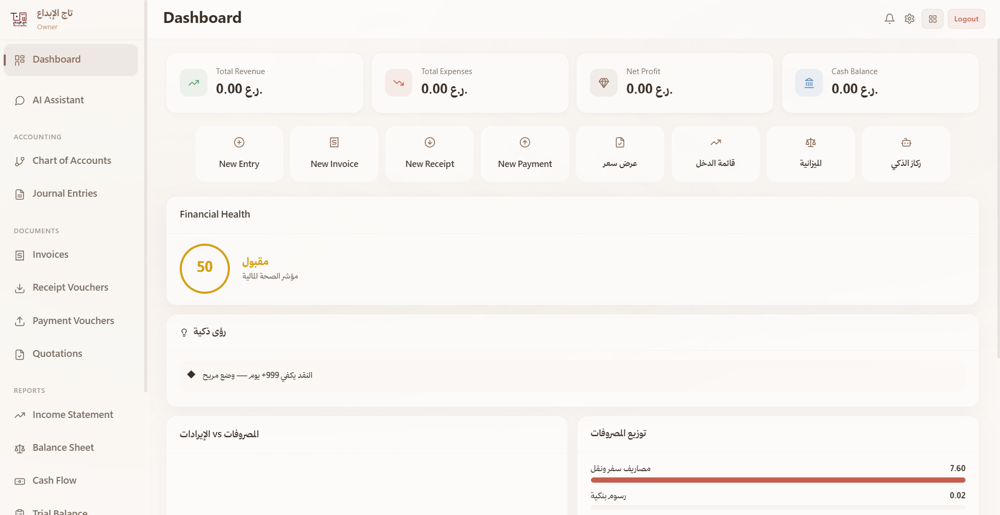
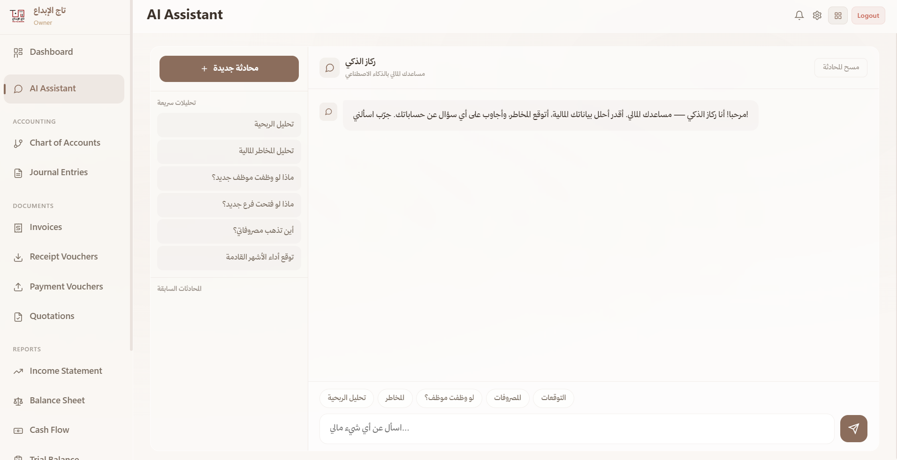
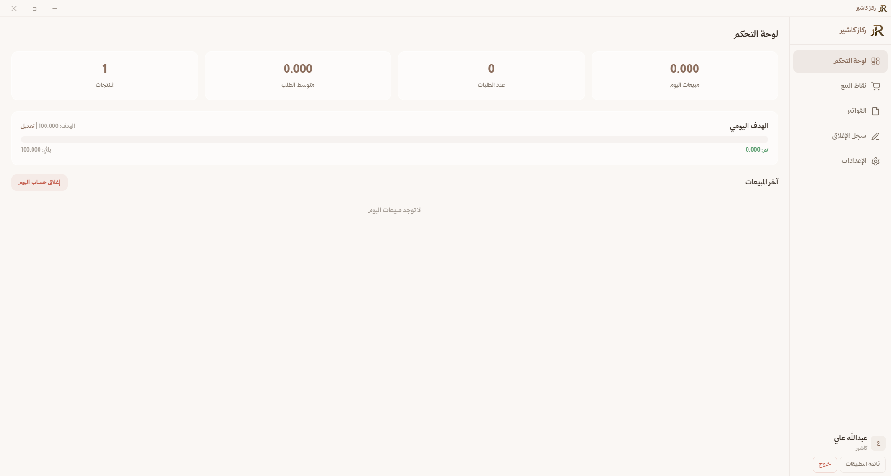
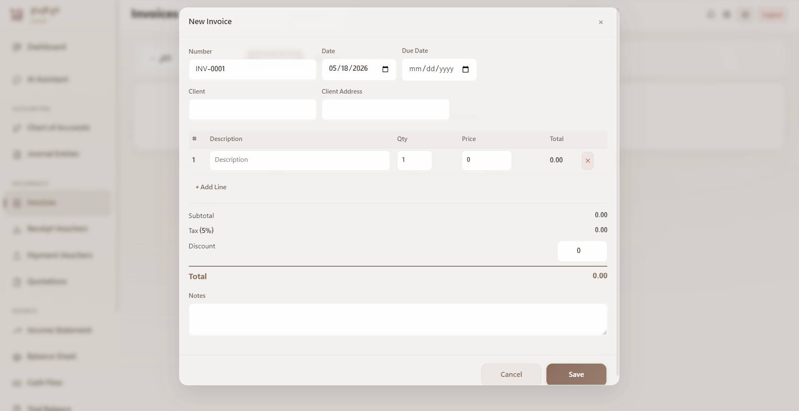
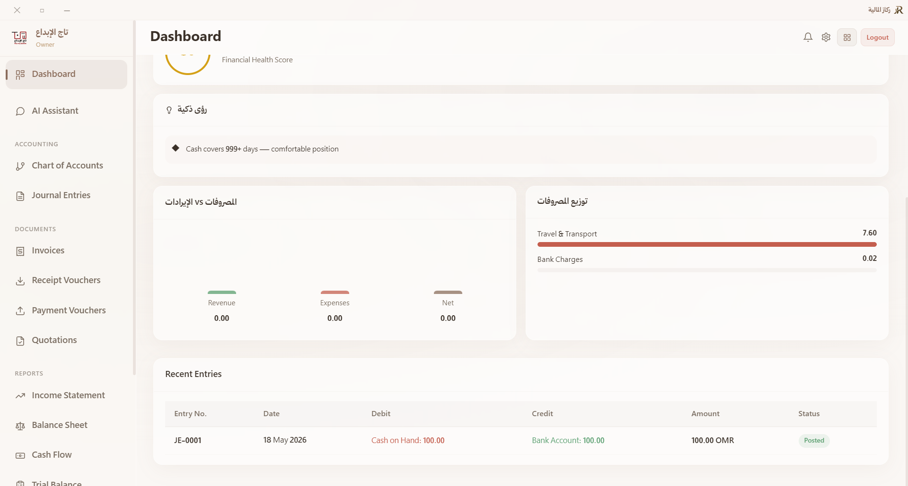
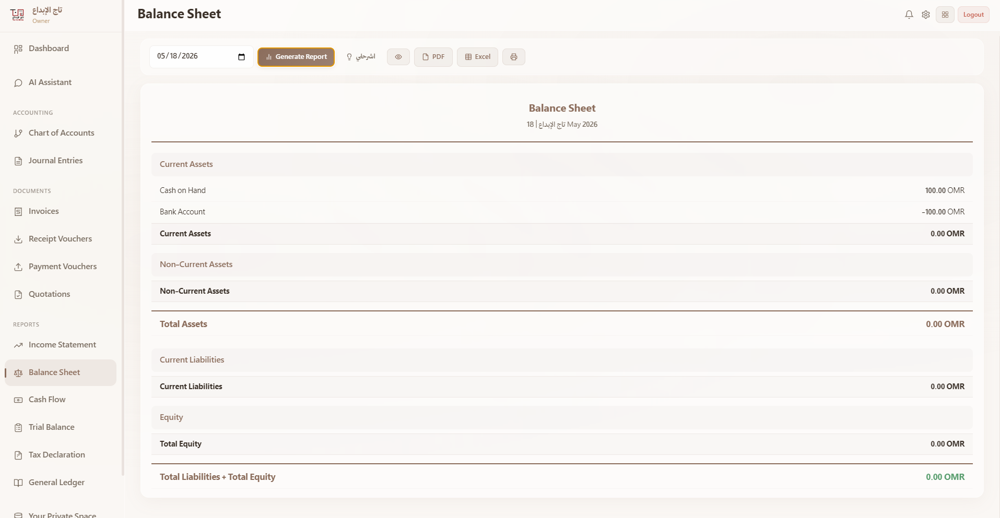
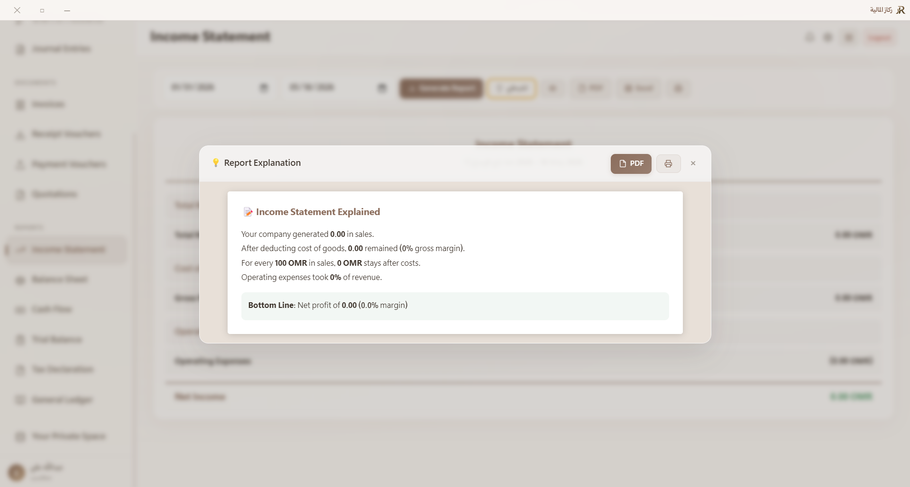
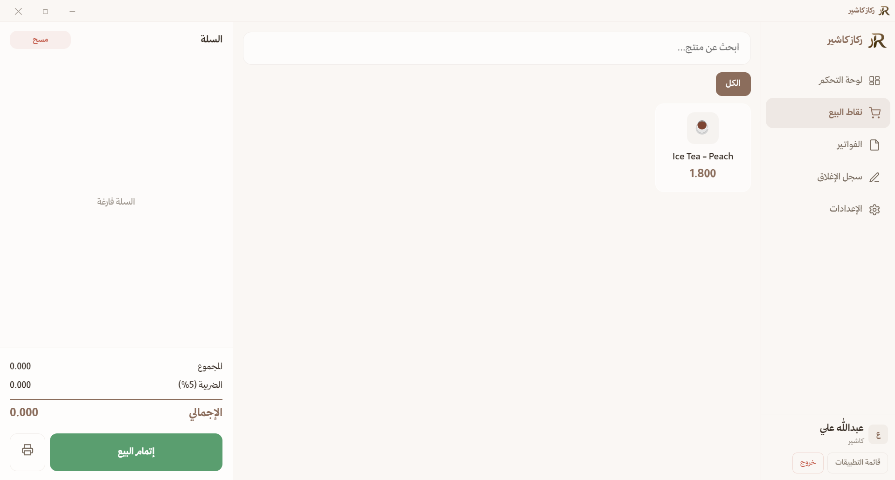
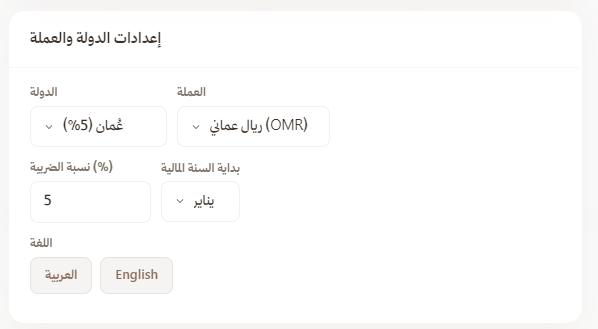

# Rakaz Manager

> AI-powered financial operating system for individuals and businesses.

---

## 🌍 Overview

Rakaz is a modern financial management ecosystem designed to simplify money management for individuals, freelancers, startups, and small-to-medium businesses.

The platform combines:
- Financial management
- Smart reporting
- AI-powered financial insights
- Expense & income tracking
- POS system integration
- Cross-platform synchronization

Rakaz focuses on simplicity, accessibility, and modern user experience — making professional financial tools easy for everyone.

---

# 📸 Preview

## Main Dashboard

---

## AI Financial Assistant

---

## Rakaz Cashier (POS)

---

# ✨ Features

## 💳 Financial Management

- Expense tracking
- Income tracking
- Budget planning
- Financial categorization
- Smart summaries

---

## 🤖 AI-Powered Financial Intelligence

Rakaz uses AI-driven systems to help users:
- Analyze spending behavior
- Detect financial inefficiencies
- Generate reports
- Suggest financial improvements
- Build smarter financial habits

---

## 🧾 Smart Reporting

Generate modern and easy-to-read reports for:
- Daily reports
- Weekly reports
- Monthly reports
- Business performance
- Sales tracking

---

## 🧠 AI Report Explanation

Rakaz includes an intelligent report explanation system designed to make financial reports easier to understand for everyone — even users without accounting or financial experience.

Instead of displaying only numbers and charts, Rakaz transforms complex financial data into clear, human-friendly explanations powered by AI.

The system helps users:
- Understand financial performance
- Identify unusual spending patterns
- Detect risks and inefficiencies
- Analyze profit and loss trends
- Receive simplified explanations for charts and metrics
- Get actionable recommendations for improving financial health

Whether the user is an individual managing personal finances or a business owner reviewing company reports, Rakaz provides clear insights that reduce confusion and improve decision-making.

The goal of this feature is to bridge the gap between raw financial data and real financial understanding.

---

## 🛒 Rakaz Cashier

Rakaz Cashier is a lightweight and modern POS system designed for simplicity and speed.

Features include:
- Sales management
- Product management
- Receipt generation
- Multi-device support
- Clean and simple UI
- Touch-friendly interface

---

## 🌐 Cross Platform

Rakaz is will be designed to work across:
- Desktop
- Mobile
- Tablets

Creating a seamless financial experience everywhere.

---

## 🌍 Multilingual Support

Rakaz currently supports:
- Arabic 🇸🇦
- English 🇺🇸

Future updates will include support for additional languages.

---

# 🎯 Vision

Rakaz aims to make financial technology:
- Simple
- Accessible
- Modern
- AI-enhanced
- Available for everyone

Especially in regions where financial tools are often outdated, overly complex, or poorly localized.

---

# 🚀 Future Plans

- AI forecasting tools
- Smart automation systems
- Team collaboration
- Cloud synchronization
- Invoice systems
- Inventory management
- Financial forecasting
- API integrations
- Open ecosystem support
